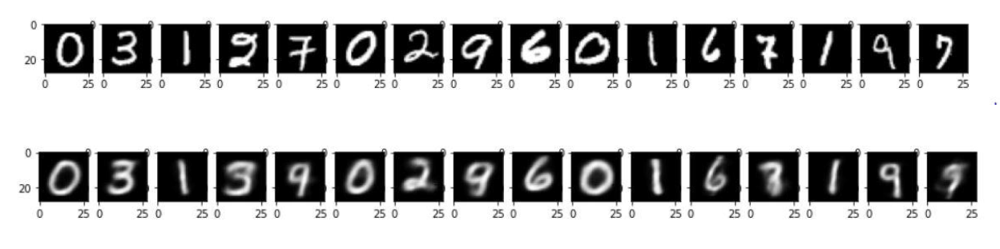
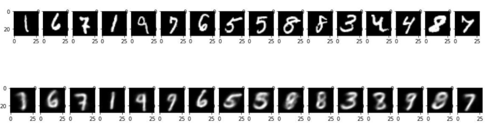
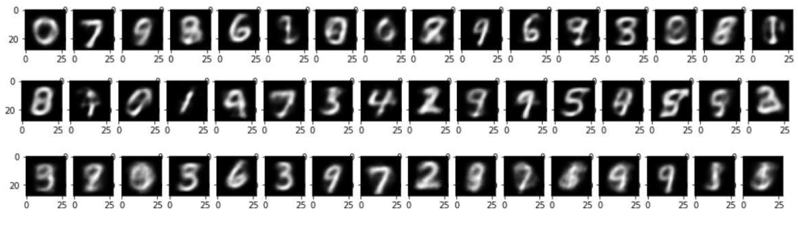

# Variational-Auto-Encoder-Tensorflow
Implementation of VAE in Tensorflow

Here are a few samples, the first row has the original MNIST images, the second row contains the reconstruction of those images

Here are new examples generated using the decoder of the network, 16 generated images in each row:

The architecture used:
Encoder – 200 neurons projected down to 32 neurons, 16 for the mean and 16 for the variance.

Activation tanh and, Dropout of 0.2 and Optimizer was Adam.

Decoder: Reverse of the encoder, sigmoid activation for the last layer to ensure the outputs between (0,1).

Loss was a combination of the KL divergence loss and the Log loss (Binary cross Entropy).
KL divergence loss was weighted by 0.009 for the outputs obtained above.
